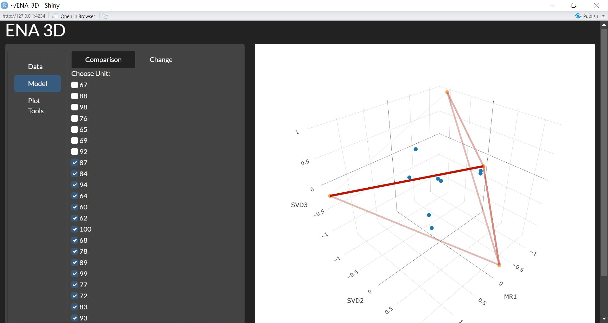

### About The Project

The project Epistemic Network Analysis 3d (ENA_3d) visualizes the ENA object in 3d space.

### Built with

[](https://shiny.posit.co/)

## Getting Started

This is an example of how you may set up your project locally.
To get a local copy up and running follow these simple example steps.

### Installation

1.  Clone the repo

    ``` sh
    git clone https://github.com/katcom/ENA_3D.git
    ```

2.  Open the project in RStudio and install the dependency

``` r
    install.packages(c('shiny','plotly','collapse','shinyjs','R6','shinyWidgets'))
```

3.  Open *`app.R`* in the `R` folder and run the script. It should open the app as shown below. 

### Prepare the data

#### Sample data

There are several sample ena dataset available inside the `sample_data` folder.
You could try it to explore the functionality of the app before preparing your own dataset

#### Prepare your own data

1.  Access <https://app.epistemicnetwork.org/> and upload your data
2.  Select **`Unit`**, **`Conversation`** and **`Codes`**
3.  Go back to "Set" and download the data
4.  Unzip the downloaded file
5.  The data file *`enaset.Rdata`* is located in the *`data`* folder

### Visualize your data

1.  Open the shiny app, which should have run after you run the *`app.R`* script
2.  Go to the **`Data`** tab and browse the *`enaset.Rdata`* you unzipped before
3.  Go to the **`Model`** tab and explore!

In the **`Comparison`** tab, you can compare networks from different groups.


In the **`Change`** tab, you can visualize the change of the network over the unit you selected.


In the **`Plot Setting`** tab, you can change the axes and scaling.


## Roadmap

-   [x] Show network in 3d space
-   [x] Silder to visualize change over units
-   [x] Compare different groups in one plot
-   [ ] Draw centroids of different group
-   [ ] Assign different colors to points of each group
-   [ ] Improve performance of plotting
-   [ ] Show the raw data in data table
-   [ ] Fix camera position when changing groups

## Contributing

Contributions are what make the open source community such an amazing place to learn, inspire, and create.
Any contributions you make are **greatly appreciated**.

If you have a suggestion that would make this better, please fork the repo and create a pull request.
You can also simply open an issue with the tag "enhancement".
Don't forget to give the project a star!
Thanks again!

1.  Fork the Project
2.  Create your Feature Branch (`git checkout -b feature/AmazingFeature`)
3.  Commit your Changes (`git commit -m 'Add some AmazingFeature'`)
4.  Push to the Branch (`git push origin feature/AmazingFeature`)
5.  Open a Pull Request

## License

Distributed under the MIT License.
See LICENSE.txt for more information.
